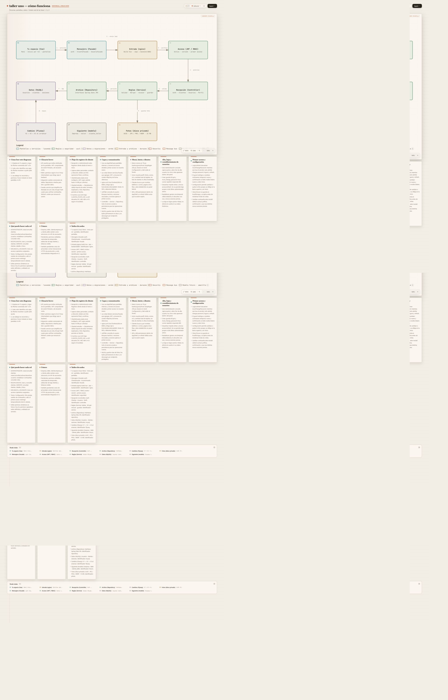

[](https://24300690-blip.github.io/taller-mecanico-planeacion/arquitectura/taller-mecanico.html)

# taller uno

Aplicación escolar para acceso seguro y administración de clientes de un taller mecánico. Incluye cinco roles, administración de usuarios, primer acceso obligatorio y configuración de perfil. Código exportado de HEAD `dd28a947059112b79c4b8d934689d786bfd0658c`; los cambios locales de editar/baja de clientes quedan pendientes.

## Stack

| Parte | Tecnología |
|---|---|
| Backend | Spring Boot 4.1.1, Kotlin 2.2.21, Spring Security, Spring Data JPA |
| Datos | MySQL 8.4 y Flyway |
| Frontend | Vue 3, Vue Router, TypeScript, Tailwind CSS 4, Vite 7, SweetAlert2 |
| Acceso | JWT, BCrypt y refresh en cookie HttpOnly |
| Infraestructura | Docker Compose y nginx 1.27-alpine |

## Carpetas

- backend/: API Kotlin, Maven Wrapper y migraciones V1–V3.
- frontend/: vistas, componentes y servicios Facade.
- scripts/: utilidades de verificación y reproducción del diagrama; algunas pueden excluirse por el escaneo de publicación.
- docs/arquitectura/: HTML, fuente JSON y captura completa.

## Requisitos y ejecución

JDK 26, Node.js compatible con Vite 7 (20.19+ o 22.12+), npm, Docker Desktop y PowerShell para estos comandos. Maven Wrapper está incluido. Configurar JAVA_HOME y PATH para JDK 26. Desde la raíz:

```powershell
if (!(Test-Path .env)) { Copy-Item .env.example .env }
# Editar .env con secretos propios antes de arrancar.
docker compose up -d --wait mysql
cd backend
.\mvnw.cmd -DskipTests package
java -jar target/taller-api-0.1.0.jar --server.port=8081
```

El backend importa ../.env y aplica Flyway al arrancar. El puerto por defecto de la API es 8080; el argumento 8081 es necesario para los proxies incluidos. El bootstrap crea el administrador configurado solo si no existe.

Frontend, desde otra terminal en la raíz:

```powershell
cd frontend
npm ci
npm run dev
```

Desarrollo: http://localhost:5173. Para servir el build con nginx, desde la raíz:

```powershell
cd frontend
npm run build
cd ..
docker compose up -d nginx
docker exec taller-mecanico-nginx nginx -t
```

nginx sirve frontend/dist en el puerto configurado y envía /api al backend del host en 8081. Límite de solicitud: 16 MB; fotos: 15 MB. Detener únicamente este proyecto con `docker compose stop nginx mysql`.

## Variables de .env.example (sin valores)

| Variable |
|---|
| MYSQL_DATABASE |
| MYSQL_PORT |
| DB_URL |
| DB_USERNAME |
| DB_PASSWORD |
| MYSQL_ROOT_PASSWORD |
| JWT_SECRET |
| JWT_ACCESS_MINUTES |
| JWT_REFRESH_DAYS |
| BOOTSTRAP_ADMIN_EMAIL |
| BOOTSTRAP_ADMIN_PASSWORD |
| BOOTSTRAP_ADMIN_NAME |
| CORS_ORIGIN |
| FRONTEND_URL |
| REFRESH_COOKIE_SECURE |
| RECOVERY_LOG_LINK |
| SPRING_PROFILES_ACTIVE |
| REGISTRO_PUBLICO_HABILITADO |
| VITE_REGISTRO_PUBLICO_HABILITADO |
| PERFIL_PHOTO_DIR |
| NGINX_PORT |

Las variables VITE se pasan al proceso de Vite o a frontend/.env.local; Vite no carga automáticamente el .env de la raíz. REGISTRO_PUBLICO_HABILITADO y VITE_REGISTRO_PUBLICO_HABILITADO deben coordinarse. Otros parámetros reconocidos por el código, ausentes de la plantilla: SERVER_PORT, CLIENTES_PHOTO_DIR y VITE_API_URL. Las fotos se guardan en disco privado y se sirven por endpoints autenticados.

## Roles y permisos

| Rol | Permisos |
|---|---|
| ADMINISTRADOR | Alta/consulta de clientes; usuarios, estados, restablecimientos y catálogo de roles. |
| RECEPCIONISTA | Alta y consulta de clientes, detalle y fotos. |
| GERENTE | Consulta de clientes, detalle y fotos. |
| MECANICO | Inicio y configuración propia; sin acceso operativo a clientes o usuarios. |
| AYUDANTE | Inicio y configuración propia; sin acceso operativo a clientes o usuarios. |

Todos disponen de perfil propio, foto, tema y cambio de contraseña. Las cuentas creadas desde Usuarios deben cambiar su contraseña en el primer acceso; servidor y router aplican la restricción. Desactivar o cambiar/restablecer contraseña revoca sesiones anteriores. El registro público está cerrado por defecto; al habilitarlo admite solo RECEPCIONISTA y MECANICO. Los permisos son fijos.

## Diagrama

[Diagrama interactivo en Pages](https://24300690-blip.github.io/taller-mecanico-planeacion/arquitectura/taller-mecanico.html) · [HTML local](docs/arquitectura/taller-mecanico.html) · [Fuente Archify](docs/arquitectura/taller-mecanico.architecture.json). El nodo de modelo futuro representa entidades existentes sin API operativa de asociación. Registro de cliente: create → POST multipart → create → persistencia; consulta: list/get/photo → GET → list/get/photo → repositorio o disco privado.

Para reproducir el HTML se requiere Archify 3.0.1 externo; el script render-architecture aplica un posprocesado editorial que invalida el sello. Esta publicación regenera directamente con Archify, sin ese posprocesado.

## Pendientes

Editar/baja de clientes: Pendiente; los cambios locales sin commit y V4 no se exportan. También quedan pendientes permisos editables, caducidad de contraseñas temporales, correo transaccional, HTTPS de producción, aviso de privacidad, bitácora visible, asociaciones empresa/taller y regresión automatizada en CI. No se ejecutaron pruebas funcionales ni builds en esta publicación documental.

### Exclusiones del escaneo de publicación

Se excluyeron scripts/verify-fase-0.2.ps1 y scripts/verify-phases.cjs por contraseñas literales, y frontend/src/views/LoginView.vue, RecoveryView.vue y RegisterView.vue por direcciones fuera de los dominios permitidos. El frontend exportado no puede compilar hasta recuperar versiones saneadas y confirmadas de esas tres vistas. El código local original permanece intacto. El commit histórico conserva un correo de autor/committer; no se reescribió el historial. La coincidencia de BOOTSTRAP_ADMIN_EMAIL corresponde al dominio permitido taller.local de la plantilla.
